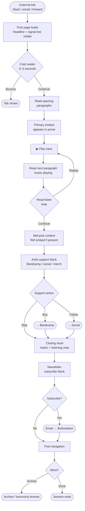
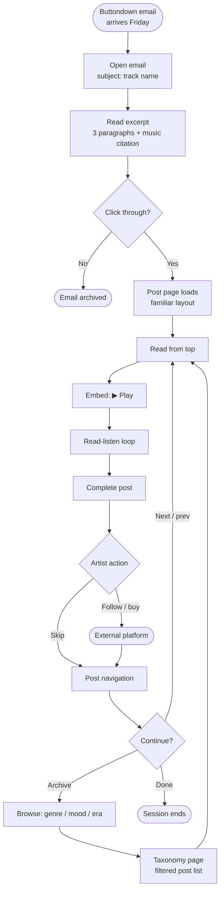
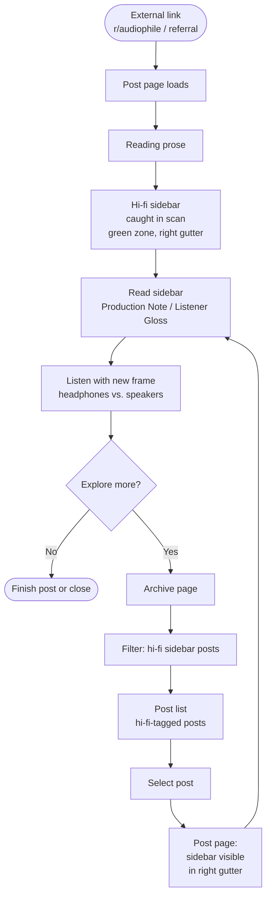
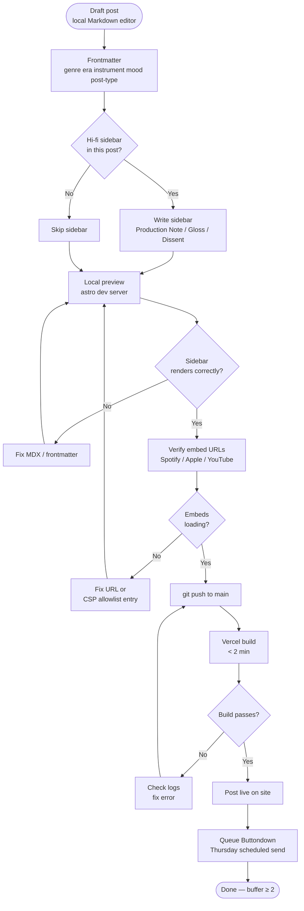
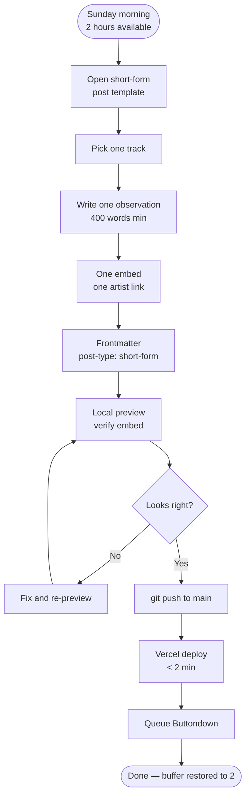

---
stepsCompleted:
  - step-01-init
  - step-02-discovery
  - step-03-core-experience
  - step-04-emotional-response
  - step-05-inspiration
  - step-06-design-system
  - step-07-defining-experience
  - step-08-visual-foundation
  - step-09-design-directions
  - step-10-user-journeys
  - step-11-component-strategy
  - step-12-ux-patterns
  - step-13-responsive-accessibility
  - step-14-complete
inputDocuments:
  - _bmad-output/planning-artifacts/prd.md
  - _bmad-output/planning-artifacts/implementation-readiness-report-2026-04-28.md
---

# UX Design Specification akirasmusicbox

**Author:** a k i r a 
**Date:** 2026-04-28

---

## Executive Summary

### Project Vision

akirasmusicbox is a weekly music publication that teaches readers *how* to listen, not *what* to listen to. The writing is the product. Every UX decision serves the text, the audio, and the direct line between reader and artist — nothing else.

### Target Users

**Discovery Reader (Marcus):** Arrives cold via a link share, skeptical, decides within seconds whether this is a listicle or something real. Needs zero friction to the first embedded audio player and a frictionless path from reading to buying a record.

**Subscriber (Priya):** Weekly ritual — arrives via email, clicks through. Needs a reliable, consistent, calm reading experience. The archive must be browsable enough to surface posts she skipped.

**Hi-fi Curious Reader (Daniel):** Found via audiophile communities, actively scanning for the hi-fi sidebar. Needs the sidebar to be visually distinct and scannable without reading the full post.

**Author / Akira (nominal week):** Writes in Markdown locally, pushes to Git. Needs frontmatter tagging to be frictionless and the preview to render exactly what will publish.

**Author / Akira (opera production week):** 2 hours, 400 words, one embed, done. Needs the short-form path to feel identical in quality to the standard path — same design, less content.

### Key Design Challenges

1. **Embed friction vs. strict CSP** — Spotify/Apple Music/YouTube iframes must render correctly under a strict Content Security Policy. If an embed fails, the post must remain fully readable and the failure must be visually indicated — not a blank gap that reads as broken.

2. **Sidebar legibility at all viewports** — The hi-fi sidebar must feel like a deliberate editorial element (not a widget or ad) on desktop, and collapse gracefully on mobile without losing its semantic identity. Readers like Daniel are specifically scanning for it.

3. **Cold-reader trust in seconds** — The page must signal "this is not a listicle" within the first scroll. Typography, density, and the absence of noise (ads, pop-ups, social share buttons) all contribute. The on-site privacy statement is part of the UX, not just legal copy.

4. **Archive scannability at scale** — As the archive grows, browsing by genre, era, instrument, mood, and post type must surface the right post without a search box. Taxonomy page design is load-bearing for long-term reader retention.

### Design Opportunities

1. **Typography as the primary aesthetic statement** — A reading-first site for a technically-sophisticated audience. A strong typographic system (hierarchy, measure, leading) can signal quality before a single word is read.

2. **The hi-fi sidebar as a recurring design signature** — If visually distinctive and consistent across posts, readers begin anticipating it. It becomes a brand element, not just a layout feature.

3. **Privacy posture as visible design** — The absence of cookie banners, pop-ups, and tracking noise is a positive UX signal for this audience. The design makes the absence of noise feel intentional and principled — a statement the site's architecture argues alongside the writing.

---

## Core User Experience

### Defining Experience

The defining interaction is the **read-listen loop** — the reader plays an embedded audio track mid-sentence, listens, reads the next paragraph, plays it again. This is not incidental; it is the product. A reader who never hits play is a reader who never had the experience. Everything — layout, load performance, CLS = 0, embed placement — exists to make that first play feel inevitable and frictionless.

The secondary core action is the **path from reading to supporting an artist**: Bandcamp link, merch link, social follow. The post succeeds when this happens. The design must make it obvious and available at the right moment without feeling like a call-to-action.

### Platform Strategy

Web only. Desktop primary — long-form reading with sidebar, wide viewport. Mobile fully functional: sidebar collapses, embeds scale, no mobile-only features. No native app, no offline requirement. Mouse/keyboard primary; touch secondary. Astro static site — zero client-side routing, zero framework overhead at read time.

### Effortless Interactions

- **Hitting play** — embed is visible, loaded (or gracefully indicated), and plays without triggering layout movement or navigating away
- **Subscribing** — one field (email), one button, plain HTML, done; no modal, no pop-up, no JS dependency
- **Finding the hi-fi sidebar** — visually distinct enough that a scanning reader notices it without looking for it; accessible as a landmark without interrupting linear reading
- **Navigating the archive** — taxonomy pages let readers filter by genre, era, instrument, mood, or post type without a search box; the right post surfaces without manual hunting

### Critical Success Moments

1. **First scroll (0–3 seconds):** Marcus decides whether this is real. Typography and absence of noise either earn trust or lose it permanently.
2. **First play (first embed interaction):** If this works — instant, no shift, plays in context — the rest of the post gets read. If it breaks or loads badly, the tab closes.
3. **Bandcamp click (post-end):** The reader completes the intent the post was written for. Passive listener → active supporter. This is the product working.
4. **Newsletter subscribe (post-end):** The reader commits to returning. Retention earned, not requested.
5. **Embed failure (edge case):** If a player fails to load, the failure must be legible — a styled placeholder, not a blank gap — so the post reads as complete and intentional regardless.

### Experience Principles

1. **The writing leads, the design follows** — no UI element competes with the text for attention. Layout, typography, and spacing serve reading, not design effort.
2. **Every interaction should be as few steps as possible** — subscribe is one field. Play is one click. Support links are inline. Nothing requires hunting or modal-dismissal.
3. **Absence as design** — no cookie banner, no pop-up, no social share row, no recommendation widget. The absence of noise is itself a signal of quality and trust for this audience.
4. **Graceful degradation is editorial responsibility** — an embed that fails silently is a broken post. Every third-party component must have a defined fallback state that preserves the integrity of the reading experience.
5. **Consistency compounds** — the hi-fi sidebar, the artist support block, the subscribe prompt must look and behave identically across every post, every week. Readers build expectations; the design must reward them.

---

## Desired Emotional Response

### Primary Emotional Goals

The site operates in a specific emotional register — warm but not soft, knowledgeable but not gatekeeping, inviting but not pandering. The reader should feel like they walked into a room where someone is talking directly to them, assumes they're intelligent, and has something real to say.

1. **Respected** — treated as a peer, not an audience. Nothing explains itself twice. Nothing condescends. Nothing performs accessibility for someone who doesn't need it.
2. **Intrigued** — pulled forward by the writing. The design creates the conditions; the writing delivers the pull. UI must not interrupt it.
3. **Interested** — genuinely engaged with the subject. Not just the page, not just the embed — the music itself. A post that achieves this is working.
4. **Comfortable** — zero friction, zero noise. Warmth comes from two sources: the visual system (typography, palette) and the silence of the interface (nothing asking for attention it hasn't earned).
5. **Safe** — the site does not surveil, manipulate, or exploit. For this audience, this is not ambient — it is explicit and legible. The absence of trackers, cookie banners, and dark patterns is not just a preference; it is a security posture that technically-literate readers will actively verify and trust or distrust based on evidence.

### Emotional Journey Mapping

| Stage | Target Emotion | Design Response |
|---|---|---|
| First landing (cold reader) | Respected + intrigued | Typography signals quality before a word is read; absence of noise signals trust |
| Mid-read with embed playing | Absorbed + engaged + active | Layout creates no distractions; CLS = 0; the reader is doing something, not watching something |
| Post-Bandcamp click | Satisfaction, wonderment, pride in completion, joy | Artist support feels like a natural conclusion — the reader participated in something real |
| Return visit (subscriber) | Comfortable + anticipated | Consistent design system; the ritual is frictionless, the expectation is rewarded |
| Embed failure | Guided + calm (not frustrated, not cynical) | Styled placeholder with clear, editorial-toned indication — not a blank gap, not an apology |

### Micro-Emotions

- **Trust → not skepticism:** Resolved by visible privacy posture and the absence of manipulation patterns
- **Curiosity → not indifference:** Resolved by writing quality and deliberate embed placement
- **Confidence → not confusion:** Nothing hidden, dark-patterned, or designed to mislead
- **Belonging → not isolation:** The specificity of the writing is the belonging signal — this was written for someone like you
- **Guided → not abandoned:** Even in failure states, the reader knows what happened and what to do

### Emotions to Actively Prevent

- **Frustration / cynicism / annoyance** — especially in edge cases (failed embeds, slow loads); these readers have been burned by bad web experiences and are primed to leave
- **Elitism / coldness** — knowledge without gatekeeping; the site must never make a reader feel they needed credentials to enter
- **Pandering** — the opposite failure; over-explaining, dumbing down, performing warmth. The reader is a peer, not an audience to be managed
- **Spammy / scammy / algorithmically-driven** — any UI pattern that optimizes for engagement over serving the reader violates the emotional contract

### Design Implications

- **Typography — approachable and stylish:** Warm, humanist type. Not cold or clinical. Not trendy or display-novelty. The type should feel like a considered, confident voice — readable and present.
- **Color palette — earthy and grounded:** Cream, brown, dark orange, green as the base. Calm, neutral, present. Teal as the single accent — used only where the reader needs orientation or invitation.
- **Comfort has two inputs:** Positive (warm palette, humanist type) + negative (no cookie banner, no share buttons, no recommendation noise)
- **Active mid-read state:** The layout must support doing, not just reading. Embed placement should invite interaction at the right moment in the narrative — not top-loaded, not buried.
- **Failure states are editorial:** A broken embed gets a styled, calm placeholder with a short explanatory line in the site's voice — not a generic error, not a blank space, not an apology.
- **Safety is verifiable:** The on-site privacy statement ("No trackers. No cookies. No algorithms. Built from scratch.") is a technical claim this audience will check. The CSP headers, the Plausible implementation, the Ko-fi plain link — these are the proof. The design surfaces the statement; the architecture makes it true.

### Emotional Design Principles

1. **Restraint is respect** — every absent element is a trust signal; what is not on the page is as deliberate as what is
2. **Warmth is structural** — palette and type create comfort before content loads; visual warmth is the first emotional message
3. **Peer, not audience** — the site never explains itself for people who don't need it, and never makes readers feel they needed credentials to arrive
4. **Active, not passive** — the mid-read state should feel like participation; the design creates the conditions for the reader to do something, not just consume
5. **Teal earns its moment** — used only for links, sidebar marker, subscribe/support actions; its restraint is what gives it meaning
6. **Design creates space; writing fills it** — intrigue and interest are not UI achievements; the design's job is to guarantee the writing gets a fair hearing
7. **Failure is editorial** — error and fallback states are part of the product; they must carry the same calm, guided tone as the rest of the site

---

## UX Pattern Analysis & Inspiration

### The Core Inspiration Model: The Three-Tier Sensory Experience

The deepest design reference for akirasmusicbox is not a website. It is the physical ritual of sitting with a record: **album art through the eyes, music through the ears, liner notes through the mind**. Three simultaneous input streams, each reinforcing the others. This is what the read-listen loop is attempting to recreate digitally.

The mapping:
- **Visual tier** → featured album art, prominent in the post layout
- **Audio tier** → embedded player, placed at the exact moment in the text where the argument earns it
- **Text tier** → the writing, functioning as liner notes: authoritative, dense, to the point, telling a story in sequence

The three tiers are **not equal weight**. Music is the load-bearing element — everything else is scaffolding that gets the reader to the moment of listening. The embed is not a player widget. It is a scene break. Something changes in the reading experience when it appears.

### Inspiring References

**Concert Program Notes**
What works: density + authority without gatekeeping. Clean, chronological format — the order itself tells a story. Typography does all the work. No ads, no engagement prompts. The text is the entire product. An expert speaks directly to you and assumes you can keep up.
*Transferable:* Voice, hierarchy, pacing, assumption of reader intelligence. The subtitle as contract — the heading tells you what kind of reading you're walking into.

**Broadcast Radio with a Host (John Peel, KEXP, old NPR Music)**
What works: the host doesn't introduce themselves. They're already mid-sentence when you tune in. You catch up, and catching up is the pleasure. The voice has authority without performance.
*Transferable:* The entrance pattern. The publication opens mid-thought. The reader tunes in — they don't subscribe. Nothing at the top of a post explains what you're about to read. The first sentence is the first sentence.

**Cassidoo's Newsletter**
What works: personal, warm, technically credible, consistent weekly format. Same structure every issue. The ritual is the product as much as the content.
*Transferable:* Ritual consistency, personal voice, format as brand. The reader recognizes the publication before reading a word.

**Long-form Substack Posts with Image Breaks**
What works: images function as breathing room AND content. Text → image → text → image creates pacing. Walls of text don't exist because the breaks interrupt at the right moment.
*Transferable:* Embeds as pacing devices — they do what images do in a Substack piece, but they also make sound.

**The Annotated Edition (Criterion Collection, footnoted Canterbury Tales, RFC errata)**
What works: primary text and the author's marginal thinking coexist. The film is complete without the director's commentary — but the commentary rewards the reader who wants to go further. Agency inside a structured container.
*Transferable:* This is the hi-fi sidebar model. Three annotation types — Production Note (technical/historical context), Listener's Gloss (curatorial guidance, friend-to-friend), Dissent or Complication (the author's own doubt, visible reasoning with limits). The primary text must be complete without them.

**Book Readers — Sci-fi, Technical Reference, Canterbury Tales, Tarot**
What works: this audience reads everything. They RTFM. They re-read. They annotate. They are comfortable with sustained density *inside a known container* — the Prologue ends before the Knight's Tale; the man page has SEE ALSO. Density without exit ramps reads as hostile.
*Transferable:* Trust the reader with long text. Signal the post's shape before they commit. Consistent three-part structure (Opening → Body → Close) that readers internalize over weeks.

**RSS Feeds**
What works: these readers curate their own information environments. RSS is the anti-algorithmic subscription mechanism. It is how the audience participates without surrendering control.
*Transferable:* RSS is the notification layer, not a second web view. The feed delivers a crafted prose excerpt (first three paragraphs) + a plain-text music citation + a direct link. Real value, honest separation. The web view is the primary artifact; the embed doesn't travel, and the feed says so honestly.

### New User Profiles Identified

**Sable — The Re-Reader**
34, threat intelligence. Read the post three weeks ago. Just listened to the record on vinyl for the first time and is back to re-read with new ears. Also returns to find a specific section to share with a colleague. Needs: stable scannable structure with named section anchors, hover-revealed ¶ links for copyable deep URLs, no embed autoplay on return, clean stable post URLs. The re-reader is the highest-signal reader the publication can have — they came back.

**The Lurker**
Reads every issue via a bookmarked URL or RSS, never subscribes, never comments. Distrusts commitment signals even more than algorithms. Full citizenship means: every post fully readable without account, email, or consent click. The lurker who reads every issue via RSS for two years without visiting the site is a loyal reader.

### Anti-Patterns to Avoid

**The OWASP Problem**
Walls of text without visual hierarchy, inconsistent formatting, wiki-energy (written by committee, no voice ownership), no reading pleasure. These readers use OWASP — and they complain about it every time.
*Avoid:* Inconsistent hierarchy, absent voice, no visual rhythm, unbroken text walls, anything that feels produced rather than written.

**YouTube-Energy Music Writing**
Thumbnail-first, algorithm-optimized, sensation-over-substance. Titles written for clicks, content designed to be recommended.
*Avoid:* Any pattern that signals "you might also like" — recommendation carousels, engagement counters, headline formats that promise more than they deliver.

**Lurker-Hostile Patterns (explicit removal list)**
- Newsletter signup in post body, sticky footer, or above-fold viewport
- Share buttons of any kind (a reader who shares copies the URL — that act is more intentional)
- Read-time progress bar (a pressure instrument — use static `~12 minutes` instead)
- Cookie consent banner (zero trackers = zero banner — make this felt as a design signal)
- Prominent subscriber count or social proof ("X readers!")
- Algorithmic "related posts" widget

**Generic Template Feel**
Every Substack looks like every other Substack. The design must be distinct enough that readers know they're somewhere specific.

### Design Inspiration Strategy

**Adopt:**
- Program notes hierarchy — expert voice, clean format, no preamble, chronological story
- Radio entrance pattern — opens mid-thought; the reader tunes in
- Annotated edition / hi-fi sidebar as the same system
- Ritual consistency (cassidoo model) — same structure every week, readers build expectations
- Full-text RSS as notification layer with honest excerpt
- Issue numbers as primary identifiers across every surface — not dates

**Adapt:**
- Three-tier sensory model — approximate the physical ritual digitally; music is load-bearing, embed is scene break not widget
- Book-reader density — trust the reader, but signal the container (post shape, three-part structure, section anchors)
- Archive as discography/commonplace book — issue cards with pull quotes + editorial retrospect notes, not a timestamp list

**Avoid entirely:**
- OWASP wall-of-text / committee voice
- YouTube-energy entrance patterns
- Lurker-hostile conversion pressure
- Generic template feel with no spatial identity

### The Closing Ritual

Every post ends with three elements in sequence:

1. **The coda paragraph** — an envoi that releases rather than summarizes. Slightly more bottom margin than body paragraphs. Protected space.
2. **The matrix number** — `akirasmusicbox — 014 — 2026` in small-caps or monospace. The catalog number stamped into the run-out groove. A mark of provenance.
3. **The listening note** — *"If you haven't listened yet, the record is above."* The only place the embed is acknowledged editorially. An invitation to loop back.

Then: previous/next navigation showing issue number and title only. If the next issue doesn't exist: *"Next issue hasn't arrived yet."* Present and honest.

---

## Design System Foundation

### Design System Choice

**Tailwind CSS + `@tailwindcss/typography` + CSS custom properties for design tokens**, scaffolded from the Astro blog starter template.

No external component library. Custom components (`<PrimaryEmbed />`, `<ReferenceEmbed />`, `<Note />`, threshold block, closing ritual) built by hand using Tailwind utilities.

### Rationale

- **Astro-native:** Tailwind integrates in one command (`npx astro add tailwind`); zero runtime overhead aligns with Astro's zero-JS philosophy
- **Reading-first fit:** `@tailwindcss/typography` is purpose-built for long-form prose — it handles measure, heading hierarchy, paragraph spacing, and blockquote styling automatically via the `prose` class; this eliminates the majority of typography CSS for a solo beginner
- **Visual control:** The earthy palette and humanist type system are too specific to theme over any existing component library without constant friction; Tailwind utilities + CSS custom properties give full control
- **Solo developer scale:** Utility classes are self-documenting and co-located with markup; no separate stylesheet to maintain; experienced dev reviewers can read and correct Tailwind markup without a handoff document
- **Custom components are simple:** `<PrimaryEmbed />`, `<ReferenceEmbed />`, and `<Note />` are layout + color + spacing decisions — exactly what Tailwind utilities handle well

### Design Tokens (CSS Custom Properties)

Defined once in `src/styles/global.css`, imported in `src/layouts/BaseLayout.astro`:

```css
:root {
  --color-cream:       #F5F0E8;
  --color-brown:       #3D2B1F;
  --color-dark-orange: #C4520A;
  --color-green:       #3A5C3A;
  --color-teal:        #2A7F7F;

  --font-body:    /* humanist serif — TBD */;
  --font-mono:    /* monospace — matrix number, code */;

  --measure:      65ch;
  --embed-gap:    3rem;
}
```

Wired into Tailwind config as named colors — never hardcode hex values alongside CSS variables:

```js
// tailwind.config.mjs
theme: {
  extend: {
    colors: {
      accent: 'var(--color-dark-orange)',
      cream:  'var(--color-cream)',
      teal:   'var(--color-teal)',
      brown:  'var(--color-brown)',
      green:  'var(--color-green)',
    }
  }
}
```

### Critical Implementation Conventions

**`not-prose` on every custom component:** `PostLayout.astro` wraps post content in `<article class="prose ...">`. Prose resets propagate to all children — including custom components. Every custom component wrapper must carry `not-prose`:

```html
<div class="not-prose my-12 border-l-[3px] border-accent bg-cream">
```

**Tailwind v4 plugin syntax:** After `npx astro add tailwind`, check `package.json` to confirm major version. In Tailwind v4, the typography plugin is declared in CSS (`@plugin "@tailwindcss/typography"`), not in `tailwind.config.js`. Mixing v3 syntax with v4 runtime silently fails — `prose` won't apply.

**CSS variable purge check:** All `:root { --color-*: ... }` declarations must live in a file Astro processes (imported inside a `.astro` file). After every build: `grep -r "color-cream" dist/` — absent means broken import chain.

**Baseline before first component:** Run `astro build` on a blank post. Confirm `prose` styles apply, CSS vars resolve, no 404s on fonts. Green baseline before committing any component.

**Kitchen sink page:** Create `src/pages/kitchen-sink.astro` early — renders every component in isolation. Gate or remove before launch.

**Content collections from day one:** Use Astro content collections with Zod schema validation for post frontmatter. Using `src/pages/` directly requires a painful migration later.

### What Not to Use

- **DaisyUI / Flowbite / shadcn** — pre-built aesthetics requiring constant theme overrides; more friction than value
- **Material UI / Ant Design** — React-centric, heavy, wrong visual language entirely
- **Bare custom CSS from scratch** — viable but slower; `@tailwindcss/typography` handles prose typesetting better than hand-rolled CSS

### Component Build Order & Risk

| Component | Risk | Notes |
|---|---|---|
| `ThresholdBlock` | Low | Static markup, props only |
| `PrimaryEmbed` | Low | `not-prose` wrapper, left border, 48px margin |
| `ReferenceEmbed` | Low-Medium | Float right + clearfix on desktop, stacks on mobile |
| `ClosingRitual` | Low | Static; prev/next navigation handled in `PostLayout` |
| `Note` (simplified, v1) | Low | Build now — see below |
| `Note` (full, container queries, v2) | High | **Defer post-launch** |

### Note Component — V1 Implementation

The full `<Note />` spec (margin column on desktop via CSS container queries, collapsible inline on tablet, end-of-section on mobile) is deferred to v2. CSS container queries combined with absolutely-positioned elements escaping `prose` column flow is high-complexity for a solo frontend beginner.

**V1 — two states, zero JS, fully accessible:**

```css
/* Mobile default */
.note {
  display: block; margin: 1rem 0; padding: 0.75rem;
  background: var(--color-cream); border-left: 2px solid var(--color-teal);
}
/* Desktop: pull into right margin */
@media (min-width: 1100px) {
  .note { float: right; clear: right; width: 220px; margin-right: -240px; margin-top: 0; }
}
```

Collapse behavior via native `<details>`/`<summary>` — zero JS, accessible, degrades cleanly. Closed by default on mobile; open on desktop.

**V2 (post-launch):** Full container query implementation with three-state layout, once the developer has hands-on experience with the live layout.

---

## Visual Design Foundation

### Color System

**Palette:**

| Token | Hex | Role |
|---|---|---|
| `--color-cream` | `#F5F0E8` | Page background, embed container fill |
| `--color-brown` | `#3D2B1F` | Primary text, high-contrast elements |
| `--color-dark-orange` | `#C4520A` | Structural accents — embed left border, issue number, Post Type Tag |
| `--color-green` | `#3A5C3A` | Hi-fi sidebar zone — confirming signal only; structural differentiation required alongside |
| `--color-teal` | `#2A7F7F` | Primary interactive accent — links and interactive states only |

**Semantic rules:**

- **Background:** cream
- **Text:** brown on cream (~12:1 contrast — well above AAA)
- **Interactive / links:** teal — restricted to navigation and interactive states only; never used decoratively
- **Structural editorial markers (embeds, issue numbers):** dark orange
- **Hi-fi sidebar identity:** green — signals zone identity; must be accompanied by structural differentiation (type scale, container, measure) — color alone is insufficient for scanners like Daniel
- **Boombox echo animation:** teal at 40% opacity, single outward pulse — behaviorally distinct from interactive teal (no hover state, no cursor change, animation only)

**Teal disambiguation rule:** Decorative teal (boombox echo) and interactive teal (links, focus states) must never be ambiguous. Interactive elements respond to hover and keyboard; the boombox echo is animation-only with no interactive affordance. This is a defined convention, not a default.

**Accessibility:**
- Brown on cream: ~12:1 — WCAG AAA for body text ✅
- Teal on cream: ~4.8:1 — WCAG AA for normal text; verify at 13px metadata sizes
- Dark orange on cream: ~4.6:1 — WCAG AA; text use at 16px+ only; run through APCA before launch
- No information conveyed by color alone — all color distinctions have structural or textual equivalents

**Future flag — dark mode:** `#C4520A` dark orange reads as an error state on dark backgrounds. If dark mode is ever pursued, this token needs a warm amber alternative. Note now to avoid a later refactor.

### Typography System

**Typefaces:**

| Role | Font | Source | Notes |
|---|---|---|---|
| Headings, labels, UI | **Space Grotesk** | `@fontsource/space-grotesk` | Validate at H1 scale with real headlines before final commit |
| Body / prose | **Source Serif 4** | `@fontsource/source-serif-4` | Optical size axis — calibrate `opsz` for body scale |
| Matrix number, code | **IBM Plex Mono** | `@fontsource/ibm-plex-mono` | |

**Self-hosting rationale:** Eliminates Google Fonts external dependency, satisfies zero-tracker posture, simplifies CSP. Install: `npm install @fontsource/space-grotesk @fontsource/source-serif-4 @fontsource/ibm-plex-mono`. Import in `BaseLayout.astro`.

**Space Grotesk — validation required:** At 36–42px display sizes, Space Grotesk can read as startup/devtools rather than publication. Before self-hosting and committing, render three real post headlines at full H1 size and evaluate. Alternatives to hold in reserve: Playfair Display (editorial, zero startup connotation), IBM Plex Serif (unified technical-document feel).

**Type scale:**

| Element | Font | Size | Weight | Line-height | Notes |
|---|---|---|---|---|---|
| Issue number | Space Grotesk | 13px | 500 | — | Small-caps, wide tracking |
| Post title (H1) | Space Grotesk | 36–42px | 600 | 1.2 | Evocative, not descriptive |
| Section heading (H2) | Space Grotesk | 26px | 500 | 1.2 | Letter-spacing: -0.01em |
| Sub-heading (H3/H4) | Space Grotesk | 18px | 500 | 1.3 | Never bold — would shout inside prose |
| Body prose | Source Serif 4 | **20px** (19px floor) | 400 | 1.7 | `opsz` calibrated for text scale |
| Metadata strip | Space Grotesk | 13px | 400 | — | Muted; verify legibility at launch |
| Post Type Tag | Space Grotesk | 11px | 600 | — | All-caps, wide tracking; min 12px if tight |
| Matrix number | IBM Plex Mono | 13px | 400 | — | Closing ritual only |
| Note annotations | Source Serif 4 | 15px | 400 | 1.6 | Slightly smaller than body |
| Code blocks | IBM Plex Mono | 16–17px | 400 | 1.5 | 85–90% of body size; less line-height than prose |

**Prose measure:** `max-width: 65ch` — but validate with a real text sample. `ch` is measured against the `0` glyph; Source Serif 4's average character width may render 65ch as ~60 effective characters. If consistently below 65 characters per line on measurement, nudge to 68–70ch.

**Pairing rationale:** Space Grotesk's geometric structure contrasts with Source Serif 4's warmth. Heading says "designed"; body says "written." For a technically-minded audience, a geometric sans heading with a warm serif body reads as editorial and considered. Weight discipline is critical: reserve bold (700) for H1/H2 only; H3/H4 at 500 to avoid headings shouting inside prose.

### Spacing & Layout Foundation

**Base unit:** 8px. All spacing: multiples of 8 (8, 16, 24, 32, 48, 64, 96).

**Key spacing:**
- Paragraph spacing: `1.5rem` (24px) — handled by `@tailwindcss/typography`
- Embed gap: `3rem` (48px) top and bottom — the inhale/exhale around the scene break
- Section break: `3.5rem` (56px)
- Annotation gutter pull (desktop): `-240px` right margin

**Layout:**

```
Desktop (≥1100px):
┌─────────────────────────────────────────────────────┐
│  nav: akirasmusicbox         Archive  About  RSS     │
├─────────────────────────────────────────────────────┤
│  Issue 014 [dark orange]                             │
│  [threshold block — Space Grotesk]                   │
│  ┌────────────────────────┐  ┌────────────────────┐  │
│  │  prose ~700px          │  │  sidebar ~220px    │  │
│  │  Source Serif 4 20px   │  │  [green zone]      │  │
│  │                        │  │  Source Serif 15px │  │
│  │  [PrimaryEmbed]        │  │  ① Note            │  │
│  └────────────────────────┘  └────────────────────┘  │
│  [closing ritual]                                    │
└─────────────────────────────────────────────────────┘

Mobile (<768px):
┌──────────────────────────┐
│  nav: akirasmusicbox     │
├──────────────────────────┤
│  Issue 014 [above fold]  │
│  [threshold block]       │
│  prose full-width 20px   │
│  [PrimaryEmbed]          │
│  <details> notes         │
│  [hi-fi sidebar, stacked]│
│  [closing ritual]        │
└──────────────────────────┘
```

**Issue number placement:** Must appear above the fold on both desktop and mobile. This is the primary trust signal for cold readers like Marcus — it proves the publication has been running consistently. Placement is a layout guarantee, not a nice-to-have.

**Hi-fi sidebar structural differentiation:** Green `#3A5C3A` marks the sidebar zone, but color alone is insufficient for scanners (Daniel). The sidebar must also have: smaller type scale (Source Serif 4, 15px), a tighter measure, and a visible container boundary (border or background distinction). Green is the confirming signal; structure is the primary one.

**Tablet breakpoint (~768–1100px):** The annotation gutter collapses. Notes transition to `<details>` inline blocks. Hi-fi sidebar stacks below post content. Embeds remain full prose-column width. This breakpoint must be explicitly implemented — it is not a graceful automatic collapse.

### Focus States & Hover Interactions

**Focus states (required, not optional):** Teal 2px outline, 2px offset, on all interactive elements. Browser default focus rings are not acceptable — keyboard navigators will notice immediately and trust erodes. This is a "respected" emotion requirement.

**Embed hover treatment:** On hover over an embed container, border-color transitions from dark orange to teal (200ms ease). Signals "this is alive, this responds to you" — reinforcing the safe/comfortable emotional register before the reader commits to clicking play.

**Boombox echo:** Animation-only, no hover state, no cursor change. Behaviorally distinct from all interactive teal elements.

### Accessibility Checklist (Pre-Launch)

- [ ] Brown on cream contrast verified: ~12:1 ✅
- [ ] Teal on cream at 13px metadata size: verify with APCA
- [ ] Dark orange text use: APCA verification, 16px+ only
- [ ] Space Grotesk Post Type Tag at 11px: bump to 12px if legibility tight
- [ ] Focus states implemented on all interactive elements
- [ ] Hi-fi sidebar marked as `<aside>` landmark with visible label
- [ ] Each embed preceded by descriptive prose line for screen readers
- [ ] No auto-playing audio or video
- [ ] Color contrast verified in both light conditions

---

## Core User Experience — Defining Experience

### Defining Experience

**The read-listen loop:** the reader encounters an embedded audio player mid-sentence, presses play without leaving the page, continues reading while the music plays in context, and returns to the player to replay a section the text just made them hear differently. This is the product. Every layout, performance, and design decision exists to make this moment feel inevitable and frictionless.

akirasmusicbox: *"Read something. Press play. Read it again. Hear what you missed."*

### User Mental Model

**How readers currently solve this:** They read a music article with a Spotify link, open Spotify in a separate tab, try to find the track, lose their place in the article, give up correlating text and audio, and settle for passive background listening. The reading and the listening are disconnected experiences.

**What they expect here:** The embed is already in the page. One click. It plays. The page doesn't move. They keep reading. The music is in the room.

**Where confusion can occur:** If the embed takes too long to load, the reader doesn't know whether to wait or scroll past. If it causes layout shift, the reading rhythm breaks and trust erodes. If it navigates away, the contract is broken.

**Mental model summary:** The embed should behave like a record player in the corner of the room — you press play on your way past, the music starts, you sit down and read. It does not demand attention. It rewards proximity.

### Success Criteria

The core interaction succeeds when:

1. **Zero layout shift on load** — the embed container reserves its space before the player renders; the text doesn't jump
2. **One click to playing** — no pre-roll, no consent prompt, no redirect; the music starts on first interaction
3. **Reading continues uninterrupted** — the embed plays in the browser tab's background audio; the reader's eye stays on the text
4. **The page acknowledges the moment** — a subtle visual pulse radiates from the embed container on play; the page knows something happened without demanding the reader look at it
5. **Graceful failure is editorially invisible** — if the embed fails, a styled placeholder maintains the post's visual integrity; the reader feels guided, not abandoned

### Novel vs. Established Patterns

**Established:** reading a webpage, recognizing an embedded player widget, clicking play — all familiar.

**Novel:** in-context audio that plays *while reading continues*, and the subtle visual feedback that radiates from the embed on playback. Most music embeds are passive widgets. This one has a physical metaphor: the embed is a speaker, and when it plays, you see the echo of it.

**No user education required** — the interaction is "click play." The pulse animation is confirmatory, not instructional. It doesn't need to be explained; it just needs to feel right.

### Experience Mechanics

**Initiation:**
The embed container appears mid-paragraph, after the prose has earned the listen. Its visual treatment (left border, warm background fill) signals interactability without a label.

**Interaction:**
Single click on the native player control. Music begins. The page does not navigate away. No modal, no redirect, no interstitial.

**Feedback — the boombox echo:**
On play, a CSS keyframe animation triggers on the embed container: a soft pulse of the teal accent color expanding outward as a box-shadow, then fading — one cycle, approximately 1.5 seconds. Not a loop. A single resonance wave, like the moment after you pluck a string. The embed's native playback indicator handles ongoing state; the page acknowledges the moment of initiation.

```css
@keyframes boombox-echo {
  0%   { box-shadow: 0 0 0 0 rgba(42, 127, 127, 0.4); }
  70%  { box-shadow: 0 0 0 12px rgba(42, 127, 127, 0); }
  100% { box-shadow: 0 0 0 0 rgba(42, 127, 127, 0); }
}
.embed-playing {
  animation: boombox-echo 1.5s ease-out;
}
```

Triggered via JS click listener on the embed wrapper. Simple, reliable, no cross-origin API dependency.

**Completion:**
The reader finishes the post. The closing ritual is below — coda, matrix number, listening note. If they haven't played yet, the listening note invites them back up.

**Embed failure:**
Container remains — same dimensions, same border, same background — with one line in the site's voice: *"This player isn't loading — find it on [platform] instead."* Linked directly. No broken layout. No blank space.

---

## Design Direction Decision

### Design Directions Explored

Four directions were generated and evaluated as an interactive HTML showcase:

- **Direction 1 — The Canonical:** Two-column layout with prose column (max 700px) and persistent annotation gutter (220px). All components rendered in context: PrimaryEmbed with boombox echo animation, ReferenceEmbed floating inline, hi-fi sidebar in a green-bordered zone, Note annotations in the margin gutter, closing ritual with matrix number and listening note.
- **Direction 2 — Editorial/Dense:** Dark brown nav, issue band across the top, tighter spacing throughout. Print editorial energy, more visual authority.
- **Direction 3 — Minimal/Airy:** Single-column, generous whitespace, hi-fi sidebar collapses to inline block. Maximum textual focus; sidebar loses its spatial parallel-track identity.
- **Direction 4 — Palette & Type Reference:** Design system specimen page — color swatches, full type scale, not a layout direction.

### Chosen Direction

**Direction 1 — The Canonical**, with two modifications identified during evaluation:

1. **Body text weight:** Source Serif 4 at `font-weight: 450` (not 400). Weight 400 reads too light at reading distance, particularly on the cream background.
2. **Dark mode:** `prefers-color-scheme: dark` is a hard requirement, not a nice-to-have. The site's primary audience (security engineers, developers) has high dark-mode adoption. Dark palette: near-black warm background (`#1C1510`), cream text (`#F0E8DC`), teal/green/dark-orange retained and slightly brightened for dark-background contrast.

### Design Rationale

Direction 1 is the only layout that preserves the "Annotated Edition" model — prose and annotation coexisting spatially on the page simultaneously, not sequentially. The sidebar as a persistent parallel voice in the right gutter is structurally load-bearing; Direction 3's inline collapse dissolves this. Direction 2's editorial density trades warmth for authority in a way that doesn't serve the emotional goals (comfortable, safe). Direction 1 holds all the components, honours the three-tier sensory model, and supports the read-listen loop without compromise.

Dark mode emerged as a requirement during direction review, not a feature request. It is non-negotiable.

### Implementation Approach

- Two-column CSS Grid: `grid-template-columns: minmax(0, 700px) 220px` with `gap: 4rem`, max-width 1200px, centred
- Sidebar column: sticky positioning, hi-fi block at top, Note annotations below keyed to prose markers
- Below ~900px: sidebar collapses; hi-fi sidebar moves to inline block within the prose column; Note annotations collapse to `<details>`/`<summary>` (zero JS, accessible)
- Dark mode via `@media (prefers-color-scheme: dark)` — CSS custom properties redefined at `:root` level; no JS, no toggle (system preference only at launch)
- Body text: Source Serif 4 variable font, `font-weight: 450` in light mode, `font-weight: 450` in dark mode (same weight — contrast improvement from dark mode background handles legibility)
- Boombox echo animation scoped to embed wrapper; single-cycle, not looped; triggered on click/play event

---

## User Journey Flows

### Journey 1 — The Discovery Reader (Marcus)

Cold entry from an external link. Skeptical, decides within 3 seconds, closes tabs fast. The read-listen loop is the conversion event; Bandcamp click and newsletter subscribe are the exits.



### Journey 2 — The Subscriber (Priya)

Arrives via Buttondown email. Established trust, weekly ritual. Archive browsability is important — she returns to posts she skipped.



### Journey 3 — The Hi-Fi Curious Reader (Daniel)

Arrives via audiophile referral. Scanning for the sidebar, not reading linearly. Archive browsability by sidebar presence is structurally load-bearing.



### Journey 4 — The Author, Nominal Publish Week (Akira)

Fast, local, self-contained. All error recovery loops back to local preview before push.



### Journey 5 — The Author, Opera Production Week (Akira)

Identical path to Journey 4, short-form variant. No sidebar required. Same design quality, less content.



### Journey Patterns

**Entry → Trust signal → Play** is the spine of every reader journey. The page has one job in the first 3 seconds: prove it's real. Typography and silence do this before a word is read.

**Read-listen loop** is not a step — a mode. The design can't force it, only allow it. CLS = 0 and embed placement in prose are the enabling conditions. Once entered, the loop is self-sustaining.

**Support action as natural conclusion** — Bandcamp / follow links appear after the read-listen loop has done its work. The journey earns the click; the design does not manufacture urgency before the reader is ready.

**Sidebar as parallel track** — Daniel's journey is structurally different from Marcus's. He's scanning, not reading linearly. The sidebar must be visually detectable from the prose column without interrupting linear readers who aren't looking for it.

**Author loop is self-contained** — the authoring journey has no dependency on reader behavior. Push → deploy → queue is three steps with one error-recovery path. Everything else is local preview.

### Flow Optimization Principles

1. **Minimum steps to play** — the primary embed must be reachable without scrolling past the fold on a standard desktop viewport. Every layout decision is subordinate to this.
2. **No dead ends** — every terminal state (embed failure, bounce from archive, tab idle) has a defined fallback. Failure states are editorial, not broken.
3. **Error recovery stays local** — author journey errors loop back to local preview, never to a broken live post. Push is the last step, not the first.
4. **Archive is a product surface** — taxonomy pages are not a fallback for search. They are a designed browsing experience, particularly for Priya (mood/genre) and Daniel (hi-fi sidebar filter).
5. **Newsletter subscribe is post-end, not interrupt** — positioned after the closing ritual. The journey earns the ask; the subscriber block does not appear before the reader has completed the experience.

---

## Component Strategy

### Design System Components

Astro + Tailwind is a utility-first stack, not a component library. Tailwind provides:

- `prose` class via `@tailwindcss/typography` — base body text, headings, lists, blockquotes, code blocks
- Layout utilities — grid, flex, gap, padding, max-width, responsive breakpoints
- Color utilities — extended with CSS custom property tokens
- Focus/hover state utilities
- Dark mode via `dark:` variant classes paired with `prefers-color-scheme` CSS

Every interactive or editorial component is custom.

### Custom Components

#### PrimaryEmbed

**Purpose:** Main in-prose audio player for the post's primary musical subject. The most critical component — if this fails, the product fails.
**Usage:** Once per post, placed within prose at the point where the reader should first play.
**Anatomy:** Outer wrapper (left border dark-orange, cream/dark surface); dark inner player bar (track name, artist, waveform placeholder, play button); optional caption below.
**States:** Loading (placeholder with identical dimensions, no layout shift); Loaded (full player); Playing (boombox echo animation — single teal pulse, ~1.5s, not looped); Failed (styled fallback block with platform link in site voice — never a blank gap).
**Variants:** Spotify / Apple Music / YouTube — iframe `src` differs, wrapper identical.
**Accessibility:** `<figure>` + `<figcaption>` with track and artist name; descriptive context sentence required in prose before the embed; `title` attribute on iframe.

#### ReferenceEmbed

**Purpose:** Secondary or comparative track referenced mid-prose.
**Usage:** Floated inline when a track is mentioned but is not the primary subject.
**Anatomy:** `float: right; clear: right` at 240px on desktop; full-width inline on mobile; same dark inner player at smaller dimensions; `REF` label above.
**States:** Same four states as PrimaryEmbed.
**Notes:** Float cleared by next block element or explicit clearfix.

#### HiFiSidebar

**Purpose:** The Annotated Edition — a parallel editorial voice alongside the prose column.
**Usage:** Optional per post; authored as frontmatter-flagged MDX block.
**Anatomy:** `<aside>` in right gutter column; `Hi-Fi Thread` label (green, small caps, letter-spaced); three annotation types — Production Note (technical recording detail), Listener's Gloss (perceptual/experiential), Dissent/Complication (challenges or contradicts the main text).
**States:** Desktop — sticky in gutter, green left border, green-tinted background zone; Mobile — collapses to full-width inline block between prose paragraphs.
**Accessibility:** `<aside aria-label="Hi-Fi notes">` — independent landmark, navigable by screen reader without reading prose first.

#### Note

**Purpose:** Marginal annotation keyed to a specific word or phrase in prose.
**Usage:** Maximum 3 per post; gutter space is finite.
**Anatomy:** Superscript teal marker in prose (①②③); corresponding content in gutter column on desktop; `<details>`/`<summary>` on mobile (zero JS, natively keyboard-accessible).
**States:** Desktop — always visible in sidebar column alongside prose; Mobile — collapsed by default, expands on tap/click/enter.

#### ArtistSupport

**Purpose:** Direct links to artist purchase and support channels.
**Usage:** Placed after post body, before the closing ritual.
**Anatomy:** Block with labelled links — Bandcamp (buy), social profiles, merch store, Patreon/crowdfunding. No urgency language. Link styling only — no button affordance.
**States:** Default; hover (teal underline).
**Constraint:** No calls-to-action. The journey earns the click; the component does not manufacture pressure.

#### ClosingRitual

**Purpose:** Post-end section signalling completion and providing navigation.
**Usage:** Every post, always.
**Anatomy:** Coda paragraph (italic, body font, ~2–3 sentences); matrix catalogue number (mono, muted, e.g. `AMB-001`); optional listening note (italic, muted); prev/next post navigation (two-column grid, Space Grotesk).
**Variants:** With / without listening note based on post length and post type.

#### NewsletterSubscribe

**Purpose:** Email capture for Buttondown subscription.
**Usage:** Post-end, after the closing ritual.
**Anatomy:** Single email `<input>`, submit `<button>`, plain HTML `<form>` POSTing to Buttondown embed endpoint.
**States:** Default; submitting (button disabled); success (Buttondown redirect to confirmation); error (Buttondown handles).
**Constraints:** Must function with JavaScript disabled. No modal. No inline validation requiring JS. No pop-up variant.

#### PostCard

**Purpose:** Post listing unit for archive and taxonomy pages.
**Usage:** Archive page, taxonomy filtered pages, related posts if implemented.
**Anatomy:** Issue number (mono, dark-orange); title (Space Grotesk, 600); genre/mood tags (small caps, brown-light); date (mono, muted); 2-line excerpt (body font); hi-fi indicator dot (green) if sidebar present.
**States:** Default; hover (teal left border animation).

#### TaxonomyPage *(page template)*

**Purpose:** Filtered post list. One template handles all taxonomy dimensions.
**Usage:** Genre, era, instrument, mood, post-type, and hi-fi sidebar presence pages — parameter differs, layout identical.
**Notes:** Not a component — an Astro page template using `getStaticPaths()` to generate one page per tag value.

### Component Implementation Strategy

All custom components are Astro components (`.astro`) unless interactivity requires a framework island. No React/Vue/Svelte unless specifically needed — and nothing identified so far requires it. Tailwind utility classes for layout and spacing; CSS custom properties for brand tokens; component-scoped `<style>` blocks for structural rules that don't map cleanly to utilities.

The `not-prose` class is required on all custom components rendered inside a `prose`-wrapped `<article>` — this prevents `@tailwindcss/typography` from overriding component styles.

Dark mode: `@media (prefers-color-scheme: dark)` at `:root` level. No JavaScript toggle at launch. System preference only.

### Implementation Roadmap

**Phase 1 — Launch blockers**
1. `PrimaryEmbed` + failure fallback
2. `HiFiSidebar`
3. `NewsletterSubscribe`
4. `ClosingRitual`

**Phase 2 — Full reading experience**
5. `ReferenceEmbed`
6. `Note`
7. `ArtistSupport`

**Phase 3 — Archive and polish**
8. `PostCard`
9. `TaxonomyPage` template
10. `src/pages/kitchen-sink.astro` — component playground and visual regression baseline

---

## UX Consistency Patterns

### Link and Interactive States

**Body text links** — teal (`#2A7F7F`), underline, `text-underline-offset: 3px`. Color deepens slightly on hover. Dark mode: teal holds without adjustment.

**Nav links** — no underline at rest; teal on hover. Muted brown-light at rest communicates hierarchy without noise.

**Post navigation cards** — cream-dark border at rest; teal left-border on hover. No underline — the whole card is the link target.

**ArtistSupport links** — plain text with label prefix (e.g. *Buy on Bandcamp →*). Teal underline on hover. Never button-styled — the journey earns the click; the component does not dress it up as a CTA.

**External links** — same as body links. No external-link icon.

### Embed States

Four defined states — every embed must handle all four in both light and dark mode:

| State | Behaviour |
|---|---|
| **Loading** | Placeholder block at exact embed dimensions — no layout shift. Static, no spinner. Matches embed background color. |
| **Loaded** | Full iframe player rendered. |
| **Playing** | Boombox echo animation fires once on wrapper — single teal pulse (~1.5s), not looped. No ongoing state indicator beyond the player's own controls. |
| **Failed** | Styled block (same dimensions, same border, same background) with one line in site voice: *"This player isn't loading — find it on [platform] instead."* Platform name is a direct link. Never a blank gap. Never an error code. |

### Form Pattern

The site has one form: `NewsletterSubscribe`. These rules apply to it and to any future form.

- One visible label per field — no placeholder-as-label
- Input: body font, site background, border uses `cream-dark`/`border` token, `2px teal` focus ring, `2px` focus offset
- Submit button: dark-orange fill, cream text, Space Grotesk 500; hover state darkens fill by ~10%
- No inline validation requiring JavaScript — validate on submit only
- Success: redirect to Buttondown confirmation page
- Error: handled server-side by Buttondown

### Navigation Patterns

**Site nav** — sticky top, 52px height, site name left (Space Grotesk 600), nav links right (Space Grotesk 500, muted). On mobile: same layout — three links fit inline at all target viewport sizes. No hamburger unless testing proves otherwise.

**Post navigation** — two-column grid at post-end. Prev post left, next post right. Each cell: issue number (mono, dark-orange), post title (Space Grotesk 500). Bordered card at rest, teal left-border on hover.

**Taxonomy navigation** — tag links in post metadata link directly to taxonomy pages. Archive page is the top-level entry. No dropdown, no mega-menu.

**Breadcrumbs** — not needed. The site is shallow (home → post, home → archive → taxonomy). Back navigation is the browser.

### Empty and Loading States

**Taxonomy page, no matches** — *"No posts tagged [x] yet."* — in site voice. Body font, centered, muted color. No system-default empty state.

**404 page** — Custom page in site voice. Brief, not clever. Link back to home and archive.

**Page-level loading** — not applicable. Astro static site — pages are pre-rendered HTML.

**Embed loading** — dimension-reserved placeholder only (see Embed States). No spinner — the placeholder is the loading state.

### Focus and Keyboard

- All interactive elements: `outline: 2px solid var(--teal); outline-offset: 2px`
- No `outline: none` without a visible custom replacement
- Tab order follows visual reading order — left to right, top to bottom
- HiFiSidebar is a navigable `<aside>` landmark — independently jumpable via screen reader
- `<details>`/`<summary>` Note components on mobile are natively keyboard-accessible — no custom JS

---

## Responsive Design & Accessibility

### Responsive Strategy

Desktop first in experience, mobile-first in CSS. The full reading experience is designed for ≥1100px. CSS is written mobile-first (min-width queries) — mobile is the base layer, desktop is the enhancement.

| Zone | Viewport | Layout |
|---|---|---|
| **Mobile** | < 768px | Single column. HiFiSidebar inline after post header. Notes via `<details>`/`<summary>`. Embeds full-width. Nav links inline. |
| **Tablet** | 768px – 1099px | Single column, wider measure. Same layout as mobile. Treated as desktop per PRD — same features, compressed layout. |
| **Desktop** | ≥ 1100px | Two-column CSS grid. Prose column left, sidebar gutter right (220px). Full two-track reading experience. |

### Breakpoint Strategy

Single custom breakpoint: **`68.75em`** (≈1100px at default font size). Using `em` not `px` — scales with user font-size preferences and passes WCAG 1.4.10 (Reflow) at 400% zoom. All other breakpoints use Tailwind defaults.

### DOM Order — Explicit Decision

**Prose first. Sidebar second. Always.** Regardless of visual placement.

The two-column grid puts the sidebar visually in the right gutter, but HTML source order must be: `<article>` prose first, `<aside>` sidebar second. A keyboard user must not tab into the hi-fi sidebar before reading a word — they don't know what it is yet. CSS Grid places the sidebar visually to the right via `grid-column`; source order is not affected.

```html
<div class="post-layout">
  <article id="main-content"><!-- prose --></article>
  <aside aria-label="Hi-Fi notes"><!-- sidebar --></aside>
</div>
```

### Dark Mode Token Pairs

Dark mode is a hard requirement. The earthy warmth of the light palette must be explicitly translated — naive inversion destroys the emotional register. Implemented as `@media (prefers-color-scheme: dark)` redefining `:root` custom properties.

| Token | Light | Dark |
|---|---|---|
| `--color-bg` | `#F5F0E8` | `#1C1510` |
| `--color-surface` | `#EDE8DF` | `#231A13` |
| `--color-text` | `#3D2B1F` | `#F0E8DC` |
| `--color-text-muted` | `#6B4D3A` | `#9A8070` |
| `--color-border` | `#EAE3D5` | `#3D2A1F` |
| `--color-teal` | `#256B6B` | `#3AAFAF` |
| `--color-green` | `#3A5C3A` | `#5A9060` |
| `--color-dark-orange` | `#C4520A` | `#E06820` |

### Accessibility Strategy

**Target: WCAG 2.1 AA** — required by PRD NFR17. No derogation.

**Colour Contrast:**

The original teal token (`#2A7F7F`) achieves ~4.3:1 on cream — this **fails** WCAG AA for normal text (requires 4.5:1). Adjusted to `#256B6B` (~4.6:1 on cream). All teal uses reference `var(--color-teal)` — one token change, no archaeology required.

| Pair | Ratio | Result |
|---|---|---|
| `#3D2B1F` on `#F5F0E8` | ~11:1 | ✅ AAA |
| `#F0E8DC` on `#1C1510` (dark mode) | ~11:1 | ✅ AAA |
| `#256B6B` on `#F5F0E8` (teal, adjusted) | ~4.6:1 | ✅ AA |
| `#3A5C3A` on `#F5F0E8` (green sidebar) | ~8.3:1 | ✅ AA |
| `#C4520A` on `#F5F0E8` (dark orange) | ~4.7:1 | ✅ AA |

**Semantic structure:**
- `<main id="main-content">` — skip link target, required
- `<nav>` for site navigation and post navigation
- `<aside aria-label="Hi-Fi notes">` for HiFiSidebar
- `<article>` wraps the post
- `<figure>`/`<figcaption>` on all embeds
- Heading hierarchy: `<h1>` post title only; `<h2>` sections; `<h3>` sub-sections — never skip levels
- All images: descriptive `alt` text (PRD FR35)

**Embedded audio players — iframe-specific requirements:**
- Every iframe must carry `title="[Platform] player: [Track] — [Artist]"` — this is what screen readers announce. Not "Spotify embed." The actual track name.
- `allow="autoplay"` must be absent from all iframe attributes (PRD NFR20). Requires a testing checklist — some embed configurations have autoplay baked in server-side.
- **Focus trapping:** Keyboard users may not be able to tab out of a third-party iframe without Escape. Requires real keyboard testing (not screen reader — keyboard alone) on Chrome and Firefox before launch. If exit is not clean: add `tabindex="-1"` to the iframe and provide an adjacent "Open on [platform]" link.

**Motion:**
`@media (prefers-reduced-motion: reduce)` gates **all** CSS transitions and animations site-wide — not just the boombox echo. Policy: if it moves and it is non-essential, it is gated.

```css
@media (prefers-reduced-motion: reduce) {
  *, *::before, *::after {
    animation-duration: 0.01ms !important;
    transition-duration: 0.01ms !important;
  }
}
```

### Implementation Guidelines

**CSS tokens:** Every color is a CSS custom property. Zero hardcoded hex values in component stylesheets. Two `:root` blocks — one default (light), one inside `@media (prefers-color-scheme: dark)`.

**Breakpoints in `em`:** `min-width: 68.75em` (not `1100px`). Scales with user zoom. Required for WCAG 1.4.10.

**Skip link:**
```html
<a href="#main-content" class="skip-link">Skip to content</a>
```
Visually hidden until focused (`position: absolute; transform: translateY(-100%)` → `:focus { transform: none }`). Target: `<main id="main-content">`.

**`PrimaryEmbed` aspect ratio:**
```css
.embed-iframe-wrapper {
  position: relative;
  aspect-ratio: 16 / 9;
}
.embed-iframe-wrapper iframe {
  position: absolute;
  inset: 0;
  width: 100%;
  height: 100%;
}
```
Spotify audio-only embeds: `aspect-ratio: unset; height: 80px`. YouTube: `16/9`. CLS = 0.

**`NewsletterSubscribe` form:**
```html
<label for="email-input">Email address</label>
<input id="email-input" type="email" name="email" required>
<button type="submit">Subscribe</button>
```
Explicit `for`/`id` pairing. Explicit `type="submit"`. No placeholder-as-label.

**`<details>`/`<summary>` (Note component):**
```css
summary { cursor: pointer; }
summary:focus-visible { outline: 2px solid var(--color-teal); outline-offset: 2px; }
details[open] .note-body { display: block; }
```
Test on NVDA + Firefox before launch. If announcement is broken, add `aria-expanded` mirroring as defensive layer.

**`HiFiSidebar` position contract:**
```css
.hifi-sidebar {
  position: sticky;
  top: calc(52px + 2rem);
  z-index: 10;
  align-self: start;
}
```
Warning: `position: sticky` breaks silently if any ancestor has `overflow: hidden` or `overflow: auto`. Never set overflow on `.post-layout` or its parents.

**Focus rings:**
```css
:focus-visible {
  outline: 2px solid var(--color-teal);
  outline-offset: 2px;
}
```
`:focus-visible` only (not `:focus` — too broad). Never `outline: none` without a visible replacement.

**Touch targets:** All interactive elements ≥ 44×44px effective tap area via padding if needed.

**Viewport meta:** `<meta name="viewport" content="width=device-width, initial-scale=1">` — never `user-scalable=no`.

### Testing Strategy

**Automated (pre-launch gate):** Lighthouse accessibility audit ≥ 90; axe DevTools zero critical violations on a representative post, archive page, and taxonomy page.

**Keyboard (pre-launch gate):** Tab through all interactive elements on a full post. Verify skip link fires and lands on `#main-content`. Verify tab exits iframes cleanly on Chrome and Firefox. Verify `<details>` Note expands/collapses on Enter/Space.

**Screen reader (pre-launch gate):** VoiceOver on macOS Safari — full post read-through. NVDA on Windows Chrome — full post read-through.

**Real device:** iPhone Safari, Android Chrome. Confirm sidebar inline collapse, `<details>` expand/collapse, embed scaling.

**Browser matrix:** Chrome, Firefox, Safari, Edge — current and previous major. IE11 excluded.

**No-autoplay checklist:** Load each embed type (Spotify, Apple Music, YouTube) in isolation. Confirm no audio starts without user interaction. Test with and without JavaScript.

### Accessibility Statement Page

A published page on the site (`/accessibility`) before launch. Contents: compliance target (WCAG 2.1 AA), known limitations (third-party iframe interiors are outside our control), contact method for reporting barriers. Required before launch.
